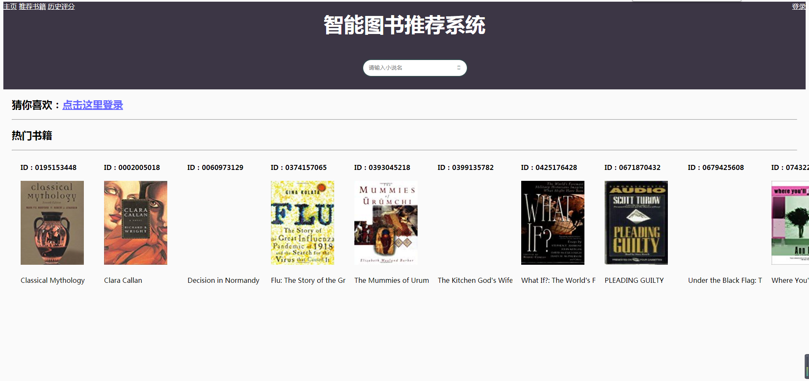
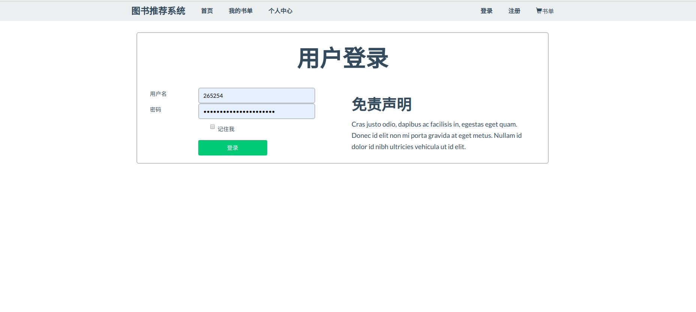
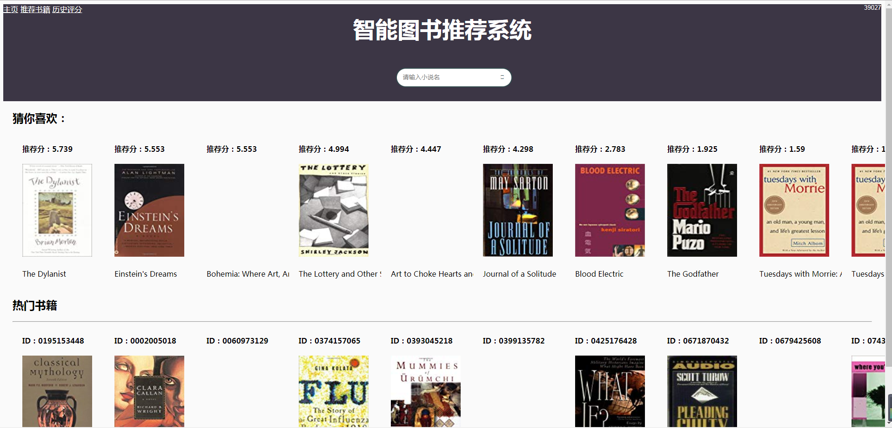
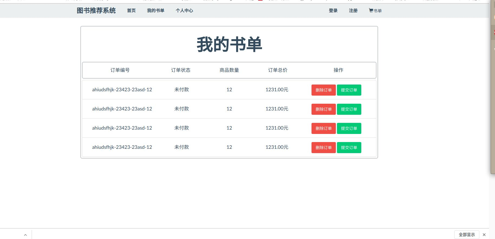
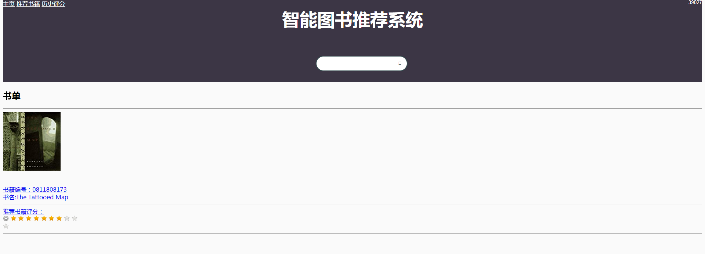

------------------------------------------------------------------------------------------------
# 智能图书推荐系统                          
------------------------------------------------------------------------------------------------

互联网访问地址[http://198.56.183.11:8080](http://198.56.183.11:8080) 

数据集下载地址[http://www2.informatik.uni-freiburg.de/~cziegler/BX/](http://www2.informatik.uni-freiburg.de/~cziegler/BX/) 

#### `主页`

#### `搜索功能`

#### `登录`

####  `推荐`

#### `推荐数据书单`

#### `历史评分书单`



*  对图书数据使用tensorflow和GPU加速实现了初版的协同过滤算法
（为了tensorflow的tensor运算，所以会创建比较大的矩阵，会初始化2个约27W乘10W的矩阵）
作者训练环境配置：
        
        环境：ubuntu 
        内存：64G
        显卡：TaiTanXP * 4  （4*12G）

速度有比较大的提升。一天内可以训练完成。但是内存占用极高。接近42G内存。
所以在git上面CF4TensorFlow.py这个文件中第12行：    
*  Rating=Rating[:5000]    
设置了一个切片区间，默认使用5000，你可以按你的配置修改这个参数。

作者选择 Rating[:10000] Epoch 60000 Loss函数曲线 
<br>

### V4 更新

*  项目整体重构
*  后端代码优化
*  前端页面全换

### V3 更新

*  介于很多同学需要数据，和对项目部署困难，现在将项目结构整体优化了。更容易部署了，随下随用

### V2 更新

*  优化了搜索框的样式
*  优化了整体配色
*  优化了书籍排版，对名字长的书籍会自动省去保留开头。
*  新增了一个书籍详情页面（基于书本的推荐可以在里面做）
*  丰富了搜索内容 

### V1 更新

*  增加了一个搜索引擎功能，可以输入书名做对应的查询，此功能还有待完善
*  增加了对推荐书籍的评分功能。
*  增加了查看历史评分书籍的功能。


## 所需运行环境

* 使用python3.6作为编程语言。使用mysql作为数据库存储.
* 需要安装pandas,flask，pymysql.
*　安装方式:
```
    pip install pandas
    pip install flask
    pip install pymysql
```
 

## 联系作者：QQ：470581985

百度网盘完整源码，带数据和推荐:
链接：[https://pan.baidu.com/s/1WKZnUVUImUO6RMfcGo3s_w](https://pan.baidu.com/s/1WKZnUVUImUO6RMfcGo3s_w) 提取码：w26s

## 项目源码介绍

图书推荐系统
```
----Flask-BookRecommend-Mysql\
    |----data                         >这个文件夹中存放数据集，数据集比较杂乱。
    |----image\                       
    |----web\                        >web端 
    |    |----logger.py               >日志记录
    |    |----config.yml              >配置参数
    |    |----logs                    >日志
    |    |----app.py                  >web入口
    |    |----utils.py                >辅助模块
    |----CF_use_python.py            >协同过滤：CF 算法
    |----CF_use_tensorflow.py        >使用tensorflow实现的协同过滤CF算法
    |----read_data_save_to_mysql.py  >读取data文件夹里面的书籍存储到数据库中
    |----README.md
```

## 项目启动方式：

* 下载数据集 数据集下载地址[http://www2.informatik.uni-freiburg.de/~cziegler/BX/](http://www2.informatik.uni-freiburg.de/~cziegler/BX/) 
* 将下好的数据集放到data文件夹下
* 运行read_data_save_to_mysql.py文件 将数据导入到mysql中。
* 进入web文件夹,运行app.py
* 在浏览器上访问 127.0.0.1:8080   
*  使用UserID和Location作为账号密码登录网站。

* 注意mysql的链接参数.默认是root,密码123456

example：
* `UserID`：39027
* `UserName`：tempe, arizona, usa

## 项目思路：

本项目实现了3个图书推荐功能：
*  基于书籍的推荐，将书籍按评论平均值排序，将前10个推送给用户。
*  基于CF（协同过滤）算法的推荐，从登录用户阅读的书籍，寻找具有相同兴趣的用户，并将这些用户阅读的书籍计算求得匹配度。按匹配度将前十个推送给用户。
*  基于slope one 的推荐。slope one讲解：
        用户\商品   商品1 商品2
        用户  1      3     4
        用户  2      4     ？
       从上表中预测用户2对商品2的评分时采用SlopeOne算法计算方式为：R(用户2，商品2) = 4 +（4-3）= 5
      这就是 SlopeOne 推荐的基本原理，它将用户的评分之间的关系看作简单的线性关系：Y = X + b

