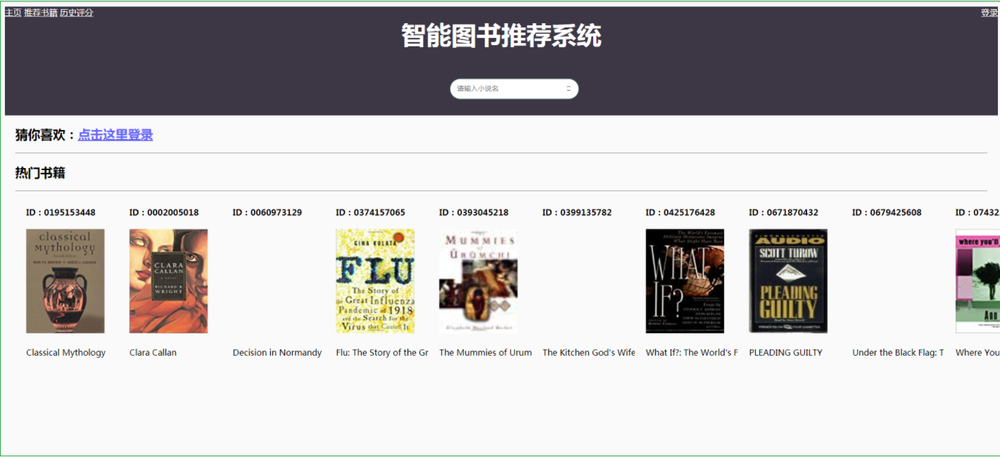
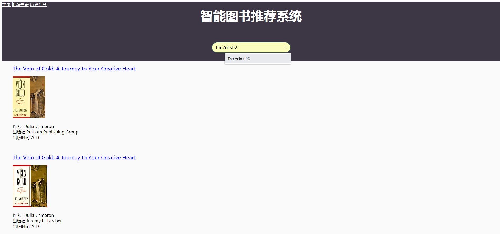
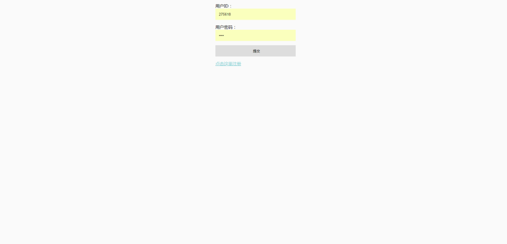
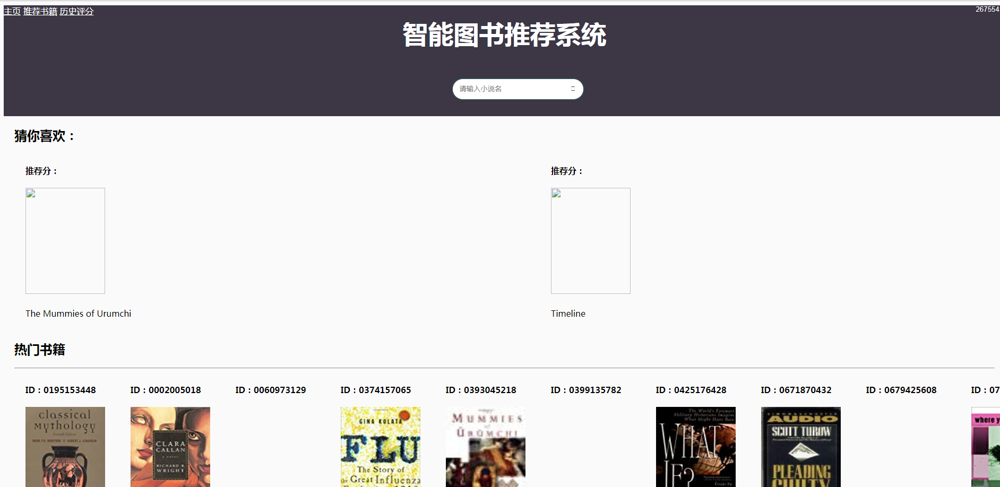

------------------------------------------------------------------------------------------------
# 智能图书推荐系统                          
------------------------------------------------------------------------------------------------

互联网访问地址[http://198.56.183.11:8080](http://198.56.183.11:8080) 

数据集下载地址[http://www2.informatik.uni-freiburg.de/~cziegler/BX/](http://www2.informatik.uni-freiburg.de/~cziegler/BX/) 

## `主页`
 
## `搜索功能`
 
## `登录`
 
## `推荐`
 

## V1.0.0.3 更新

    介于很多同学需要数据，和对项目部署困难，现在将项目结构整体优化了。更容易部署了，随下随用

## V1.0.0.2 更新

    1.优化了搜索框的样式
    2.优化了整体配色
    3.优化了书籍排版，对名字长的书籍会自动省去保留开头。
    4.新增了一个书籍详情页面（基于书本的推荐可以在里面做）
    5.丰富了搜索内容 

## V1.0.0.1 更新

    1.增加了一个搜索引擎功能，可以输入书名做对应的查询，此功能还有待完善
    2.增加了对推荐书籍的评分功能。
    3.增加了查看历史评分书籍的功能。

## 所需运行环境

    使用python3.6作为编程语言。使用mysql作为数据库存储.
    需要安装pandas,flask，pymysql.
    安装方式:
    cmd下
    pip install pandas
    pip install flask
    pip install pymysql

 
## 联系作者：QQ：470581985

百度网盘完整源码，带数据和推荐:
链接：[https://pan.baidu.com/s/1WKZnUVUImUO6RMfcGo3s_w](https://pan.baidu.com/s/1WKZnUVUImUO6RMfcGo3s_w) 提取码：w26s

## 项目源码介绍

图书推荐系统

>      data               >这个文件夹中存放数据集，数据集比较杂乱。   
>>       BX-Books.csv        >关于27万条的书籍的信息，涉及书籍编号，书籍名，书籍作者....
>>       BX-Users.csv        >关于27万条的用户信息，涉及用户ID，用户区县，用户省份，用户年龄。
>>       BX-Book-Ratings.csv >近115万条的用户评分信息，涉及到用户ID，书籍ID，打分rating    
>>       booktuijian.csv     >这个将会由算法计算产生推荐结果。
>     BookWebAPI.py       >启动这个文件开启服务器。启动方式：在更目录下进入cmd输入    python BookWebAPI.py  
>     CSVToMysql.py       >读取data文件夹里面的书籍存储到数据库中。
>     CF                  >协同过滤1：CF 算法
>     slope one           >协同过滤2：slope one 算法
>     其他文件夹           >提供给前端页面和前端页面的依赖

## 项目启动方式：

数据集下载地址[http://www2.informatik.uni-freiburg.de/~cziegler/BX/](http://www2.informatik.uni-freiburg.de/~cziegler/BX/) 
    * 将下好的数据集放到data文件夹下
    * 运行CSVToMysql.py文件 将数据导入到mysql中。
    * 进入BookwebAPI 运行即可。  

如果需要测试推荐功能，需要计算推荐表 也就是生成booktuijian.csv文件，并将其导入mysql数据库中
`计算方式`：
*  将BX-Book-Rating.csv文件放入CF文件夹下，运行CF.py文件,将生成的book推荐表放入data文件夹下，执行CSVToMysql.py，导入推荐表的部分。
*  使用UserID和Location作为账号密码登录网站。

## 项目思路：

    本项目实现了3个图书推荐功能：
    1 基于书籍的推荐，将书籍按评论平均值排序，将前10个推送给用户。
    2 基于CF（协同过滤）算法的推荐，从登录用户阅读的书籍，寻找具有相同兴趣的用户，并将这些用户阅读的书籍计算求得匹配度。
     按匹配度将前十个推送给用户。
    3 基于slope one 的推荐。slope one讲解：
        用户\商品   商品1 商品2
        用户  1      3     4
        用户  2      4     ？
       从上表中预测用户2对商品2的评分时采用SlopeOne算法计算方式为：R(用户2，商品2) = 4 +（4-3）= 5
      这就是 SlopeOne 推荐的基本原理，它将用户的评分之间的关系看作简单的线性关系：Y = X + b

